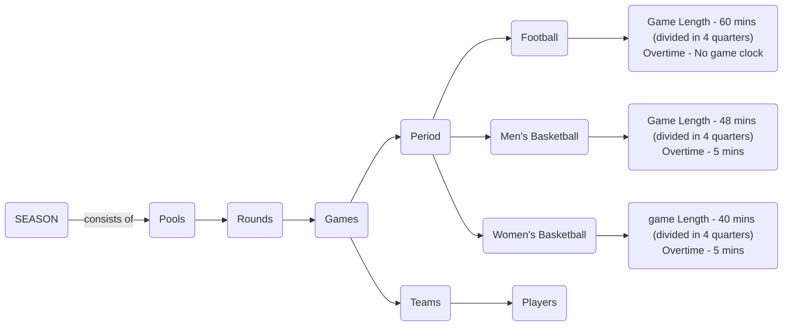

# American Sports Hierarchy

Created by: Sakshi Sinha
Created time: March 6, 2025 7:35 AM
Reviewers: Sarvagnan Subramanian
Deadline: March 7, 2025
Status: In progress

# Objective

### **Understanding the American Sports Hierarchy**

- The initial phase involves gaining a deep understanding of the American sports structure.
- The hierarchy is primarily governed by the **NCAA (National Collegiate Athletic Association)**.

# Introduction to American College Sports

Fig : This represents the hierarchy of American sports, with terms in brackets (from Genius) serving as their equivalents in American sports terminology.

https://app.diagrams.net/#G1VWmzQBwpghxxKtem9lRj9ZpaZGg5fA4B#%7B%22pageId%22%3A%22Y479pStkiAA219GPw9xE%22%7D

## Sport (League)

- A sport is translated as a League in Genius sports data.
- The League is further includes 3 parts:
    - Division
    - Club
    - Competitions
    
    These are well explained in the later part of this page. 
    
- In America, **football**, **men's basketball,**  and **women's basketball** are the most popular and highly valued sports at the collegiate level.

### Football

- American football is a competitive team sport played between two teams of **11 players** each.
- The team with the most points at the end of **four** **15-minute quarters** wins.
- A **halftime break** occurs after the second quarter. If tied, an **overtime period** may be played.

### Men’s Basketball

- Men’s basketball is a fast-paced game played between two teams of **five players** each.
- The game duration for **NCAA** includes **two** 20-minute halves.
- If tied, an overtime period of **5 minutes** is played, with variations depending on the league.

### Women’s Basketball

- Women’s basketball follows a similar structure to men's basketball but with slight variations in game duration.
- **WNBA** games consist of **four 10-minute quarters.**
- **High school** games typically have **four 8-minute quarters**. If tied, an **overtime period of 5 minutes** is played, with variations depending on the league.

## Divisions & Conferences

### What are Divisions and Conferences?

### **DIVISION:**

- The NCAA is organized into three divisions, based on factors such as a college’s reputation, level of competition, financial resources, and overall wealth.

### **CONFERENCE:**

- Within each division, schools are organized into **conferences**, which are groups of teams that compete regularly. These conferences help coordinate schedules, championships, and rankings.
- Teams have the flexibility to switch conferences based on their preferences.
- Most colleges participate in a **multisport conference**, meaning they compete against the same group of schools in multiple sports. However, some schools may belong to **different conferences for different sports** based on competitive or logistical considerations.
- Additionally, it's not mandatory for every team in a conference to play against all other teams each year.
- In college sports, **conferences** are groups of teams that often work together as a unit. They make joint decisions, like negotiating TV deals and media rights. So, when working with one team from a conference, it's useful to work with the whole conference because they often act as a group. Also, these conference groupings can change over time—they're not fixed.
- **Conference standings** are based only on how well a team performs **against other teams in the same conference**. Hence, only games played within the same conference affect conference rankings, even though stats from other games are still counted.

**What happens when a conference collapses?**

- The collapsing of a conference doesn’t impact the current data it only affects the historical data.

### Division I

- The highest level of college sports, with the largest schools, the most athletic scholarships, and the most competitive programs. These schools generate significant revenue from sports and often appear on national television.

### Division II

- A mid-level division balancing athletics and academics. Schools in this division offer fewer scholarships than Division I but still maintain a competitive sports environment.

### Division III

- Focuses primarily on academics, with no athletic scholarships offered. These schools emphasize student participation, with a strong focus on balancing sports with education.

### MEN’S AND WOMEN’S BASKETBALL

### MEN’S FOOTBALL

 

- Unlike basketball, Division I in football is further divided into two parts:
    - **FBS (Football Bowl Subdivision):** FBS (Football Bowl Subdivision) is the top level of NCAA Division I college football in the U.S. It features the most competitive programs with larger budgets, more scholarships, and bigger stadiums. FBS teams compete in [bowl games](https://en.wikipedia.org/wiki/Bowl_game) and the College Football Playoff.
    - **FCS (Football Championship Subdivision):** FCS (Football Championship Subdivision) is the second tier of NCAA Division I football, featuring smaller schools with limited athletic budgets. Unlike FBS, it determines its national champion through a 24-team playoff. FCS programs typically have smaller stadiums and fanbases.

## School (Clubs)

- Schools refers to any educational institution, like colleges and universities.
- The data source (Genius) used in this project already assigns a unique ID to each team in the existing dataset, making the use of this API unnecessary.

## Teams

## Players (Persons)

- Players are individuals who participate in the game as members of a team.
- The Genius alternative for Players in Persons
- Within a team, players are categorized by level Freshman, Sophomore, Junior, or Senior. In US education system, these terms are used to describe the year of high school or college that a student is in.

## Games

A **game** is a single event where two teams compete. A game belongs to a **season** which is a collection of games played over a specific time period. In college sports, a **season** follows the **academic year** (the school year).

## Season (Competition)

In **organized sports leagues**, a **season** refers to the time of year when official games are played.

The season duration differs game-to-game. 

| **GAME** | **SEASON DURATION** |
| --- | --- |
| Men’s Football | August - January |
| Men’s Basketball  | October - April |
| Women’s Basketball | May - October |

A year can often be broken up into several distinct sections (sometimes themselves called seasons). These are: a **preseason**, a series of exhibition games played for training purposes; a **regular season**, the main period of the league's competition; the **postseason**, a playoff tournament played against the league's top teams to determine the league's champion.

### Preseason

In sports, **preseason** refers to the period before the official start of a competitive season. It is used for preparation, practice, and warm-up games. 

### Regular Season

The **regular season** is the main phase of a sports league where teams compete in a set number of games. It often follows a **double round-robin** format, meaning each team plays every other team twice—once at home and once away. The results are consolidated, and the team with the best record at the end is declared the winner.

### Postseason

After the **regular season**, many sports leagues have **playoffs**, where top teams compete in a knockout tournament. The winner of the playoffs earns the league’s top prize, often considered more important than the regular season title.

## Team Size and Period

## Pools

- Teams or players are divided into smaller groups (pools) where they compete against others within their pool. Performance in this stage determines advancement.

## Rounds

- After the pool stage, the top teams or players advance to the next **rounds**, which can be single-elimination (knockout) or double-elimination formats, progressing toward the final.

## Games

- In each season, multiple games are played, and each game has a specific time period during which it takes place. The duration of each game varies, as every game has a different time period.

### Football

- **Team Size**:
    - 11 players per team on the field at a time.
- **Game Length**:
    - **60 minutes** of regulation play, divided into 4 quarters (15 minutes each).
- **Overtime**:
    - First team to score wins, if no score, another overtime period is played.

### Men’s Basketball

- **Team Size**:
    - **5 players** per team on the court at a time.
- **Game Length**:
    - **48 minutes** of regulation play, divided into 4 quarters (12 minutes each in the NBA).
- **Overtime**:
    - **5-minute** periods.
    - If tied after overtime, additional overtime periods are played.

### Women’s Basketball

- **Team Size**:
    - **5 players** per team on the court at a time.
- **Game Length**:
    - **40 minutes** of regulation play, divided into 4 quarters (10 minutes each in the WNBA).
- **Overtime**:
    - **5-minute** periods.
    - If tied after overtime, additional overtime periods are played.

Additionally, each game includes detailed statistics about the teams and players involved. These statistics track the performance and other important data of both the teams and the individual players during the game in the current season.

[Athlyte Aims & Projects](American%20Sports%20Hierarchy%201aee700e389c804ea71befb8bc0fc558/Athlyte%20Aims%20&%20Projects%201b9e700e389c8055a470d12eeb8356a4.md)